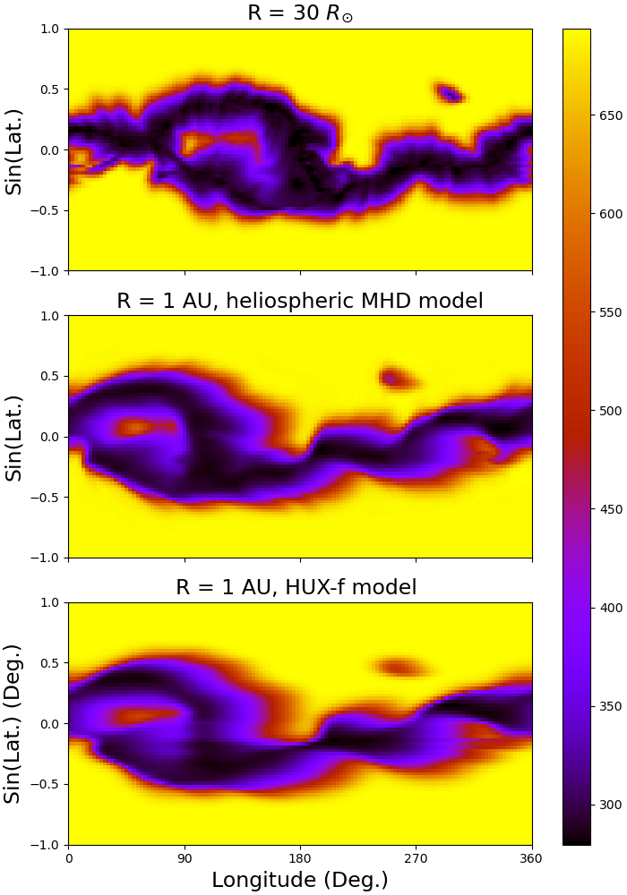

# <!-- .element height="10%" width="10%" --> HUX (Heliospheric Upwind Extrapolation)

The following notebooks include an analysis of the HUX model (Heliospheric Upwind Extrapolation) developed by Riley et al [1]. 
The HUX model is a technique to map solar wind streams from the Sun to 1 AU. By neglecting magnetic field, pressure gradient and gravity, the fluid momentum equation reduces to the inviscid Burgers' equation.

In order, to understand the weight of adding thermal pressure and proton mass density to forecast solar wind streams, I applied PDE-FIND an algorithm developed by Rudy et al [2]. Given a large library of candidate terms consisting partials and nonlinearities in spatial domain, PDE-FIND finds the optimal subset of active library terms from a time sequential data-set.

The results verify that the HUX model is a parsimonious model which matches the dynamical evolution captured by global models, yet is as simple as the ballistic approximation.

The solar wind streams motion can be described as the fluid momentum equation in corotating frame of reference:
	
$-\Omega_{rot} \frac{\partial v}{\partial \phi} + (v \cdot \nabla)v = \frac{1}{\rho} \nabla P - \frac{G M_{s}}{r^2}e_{r}$

By neglecting magnetic field, pressure gradient and gravity, the fluid momentum equation reduces to the inviscid Burgers' equation.

$\frac{\partial v_{r}}{\partial \phi} = \frac{1}{\Omega_{rot}} v_{r} \frac{\partial v_{r}}{\partial r}$

By the upwind difference algorithm, we can discretize the inviscid Burgers' equation as follows:

$v_{i+1, j} = v_{i, j} - \Delta r ( a^{+} \Delta^{-} + a^{-}\Delta^{+})$

The indicies i and j refer to the r and $\phi$ grids, respectively where
    
$a^{+} = max(-\frac{\Omega_{rot}}{v_{i,j}}, 0)$

$a^{-} = min(-\frac{\Omega_{rot}}{v_{i,j}}, 0)$

$\Delta^{-} = \frac{v_{i,j} - v_{i,j-1}}{\Delta \phi}$

$\Delta^{+} = \frac{v_{i,j+1} - v_{i,j}}{\Delta \phi}$

Since $\frac{-\Omega_{rot}}{v_{i,j}}$ is always less than zero for the solar wind, then $a^{+} = 0$. 
Therefore, equation (3) simplifies to
    

$v_{i+1, j} = v_{i, j} + \frac{\Delta r \Omega_{rot}}{v_{i,j}} (\frac{v_{i, j+1} - v_{i,j}}{\Delta \phi}) $

In order to add the effect of acceleration from 30 $R_{\odot}$ to 1 AU, the following velocity boost is applied to the inner boundary.
    
$v_{acc}(r)=\alpha v_{ro}(1 - \exp(-r/r_{h}))$

Where $v_{ro}$ is the speed at 30$R_{\odot}$, $\alpha$ and $r_{h}$ are constants. Therefore, the velocity boost results in $v(r) = v_{ro} + v_{acc}(r)$. 

The simple upwind technique resulted in pearson correlation coefficient of 0.98.
Figure 1(a) shows the initial proton velocity profile at 30$R_{\odot}$. Figure 1(b) shows the  heliospheric MHD model solution at 1 AU. Lastly, figure 1(c) shows the results of the HUX model mapping from 30 $R_{\odot}$ to 1 AU. By comparing figure 1(b) and 1(c) it is visible that the HUX model is a close approximation to the heliospheric MHD model solutions. 

# References
[1] [Riley, P. and Lionello, Roberto. Mapping solar wind streams from the Sun to 1 AU: A comparison of techniques. Solar Physics, 270(2), 575–592, 2011.](https://www.researchgate.net/publication/226565167_Mapping_Solar_Wind_Streams_from_the_Sun_to_1_AU_A_Comparison_of_Techniques)

[2] [Samuel H. Rudy, Steven L. Brunton, Joshua L. Proctor, and J. Nathan Kutz. Data-driven discovery of partial differential equations. Science Advances, 3(4):e1602614, 2017.](https://arxiv.org/abs/1609.06401)

# Dependencies
1. [Python >= 3.7](https://www.python.org/downloads/)
1. [numpy >= 1.19.1](https://numpy.org/install/)
3. [matplotlib >= 3.3.1](https://matplotlib.org/users/installing.html)
4. [scipy >= 1.5.0](https://www.scipy.org/install.html)

# Authors
[Predictive Science Inc.](https://www.predsci.com/portal/home.php)

- Pete Riley, pete@predsci.com

- Opal Issan, oissan@predsci.com

# License
MIT

